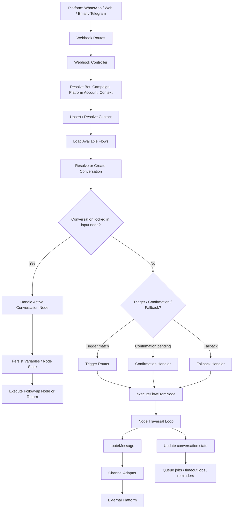
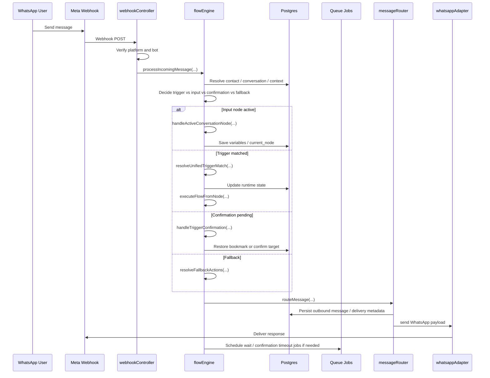

# Runtime Flow Diagram And Sequence Map

Last updated: 2026-04-03

This document turns the current runtime into a visual map. It is based on the actual backend flow entry points and queue processors in the repository.

## 1. Runtime Overview

The platform runtime is a staged pipeline:

1. inbound platform event arrives
2. webhook controller identifies the bot and resolves context
3. engine resolves conversation state
4. trigger / confirmation / input / fallback routing decides what happens
5. flow executor traverses nodes
6. outbound router serializes and sends messages
7. queue processors handle delayed jobs and confirmations

## 2. High-Level Flow Diagram

## 3. Sequence Map

## 4. Step-by-Step Sequence Map

### Inbound message path

1. Meta sends a webhook.
2. Webhook routes to the controller.
3. Controller verifies token, channel, and bot selection.
4. Controller normalizes the inbound payload into text, button reply, list reply, or status.
5. Engine resolves workspace, project, campaign, and contact context.
6. Engine opens or reuses a conversation.
7. Engine checks if the conversation is currently inside an active input node.
8. If yes, the input handler owns the turn.
9. If not, trigger routing runs.
10. If a trigger matches, a flow node is launched.
11. If confirmation is pending, the confirmation handler resolves it.
12. If no route matches, fallback is used.
13. The flow executor walks nodes and generates outbound messages.
14. Outbound messages are serialized by the router.
15. The channel adapter sends the final payload.

### Flow traversal path

1. `executeFlowFromNode(...)` receives a start node and node graph.
2. The loop sets `currentNode`.
3. Node type is normalized.
4. The engine emits a payload if needed.
5. The engine updates `current_node`, `variables`, `status`, or `retry_count`.
6. The engine chooses the next edge by source handle.
7. If a next node exists, the loop continues.
8. If the node is waiting-type, inactivity jobs are scheduled.
9. If no next node exists, the conversation is naturally closed back to idle.

### Confirmation path

1. Trigger match occurs while a conversation is active.
2. The engine stores a bookmark in conversation context.
3. The engine sends a button confirmation prompt.
4. If the user taps Yes, the bookmarked trigger is executed.
5. If the user taps No, the bookmark is restored.
6. If the confirmation expires, the timeout processor restores the bookmark automatically.

## 5. Operational Notes

- `current_node` is the authoritative runtime lock.
- `conversation.context_json` carries bookmark and confirmation overlay state.
- queue jobs are used for delayed work, not as the source of conversation truth.
- the engine is imperative and branch-heavy, but the routing responsibilities are now divided into helper services.

